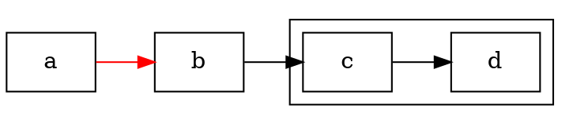
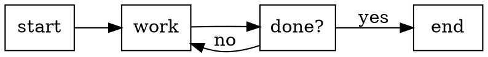
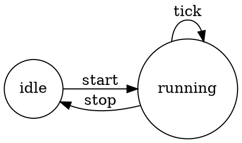
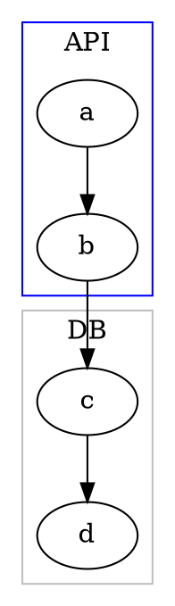
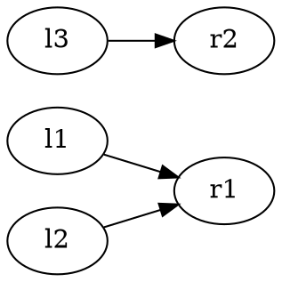

# gviz-dot-syntax

DOT is the plain-text graph language rendered by the `%graph-viz` Gall
agent (see [[gviz-gall-api]]) and shaped into diagrams by
[[gviz-patterns]]. This skill is the language reference: grammar,
attributes, colors, and the quirks that bite.

`%graph-viz` v1 parses the **entire** DOT grammar, lays out with the
`dot` engine, and emits SVG. Features it parses but does not draw
(HTML labels, `record` shapes, non-`dot` engines, non-`svg` formats)
are called out below and rejected with a structured `$err` rather than
a crash.

> Canonical upstream grammar: https://graphviz.org/doc/info/lang.html
> This skill is self-contained; the link is for historical context.

## Graph types

```dot
graph   G { a -- b }      // undirected: edges use --
digraph G { a -> b }      // directed:   edges use ->
strict digraph G { ... }  // strict: merge duplicate edges into one
```

- `digraph` requires `->`; `graph` requires `--`. **Mixing is a parse
  error at the operator** (`a -- b` inside a `digraph` → `%parse`).
- `strict` collapses parallel/duplicate edges between the same
  ordered endpoint pair into a single edge (last attributes win).
- The graph id is optional: `digraph { ... }` is anonymous (`name=''`).

### Subgraphs and clusters

A `subgraph` is a statement group. It scopes attribute defaults and
can serve as an edge endpoint (cross-product expansion).

```dot
subgraph name { a b c }        // named group
{ a b c }                      // anonymous group (keyword optional)
subgraph cluster_x { a b }     // name starting cluster* → drawn box
```

- Subgraphs whose name begins with `cluster` render as a background
  rectangle with optional `label`, `color` (border), and
  `style=filled` + `fillcolor`/`bgcolor`.
- `{a b} -> {c d}` expands to the cross product a→c, a→d, b→c, b→d.

## Statements

DOT is a list of statements; `;` between them is optional. The five
statement forms (`$stmt-body` in `sur/ast.hoon`):

| form | syntax | meaning |
|---|---|---|
| node | `id [attrs]` | declare/attribute a node |
| edge | `a -> b -> c [attrs]` | edge chain; ≥2 endpoints |
| attr-default | `node [attrs]` / `edge [...]` / `graph [...]` | set defaults for *subsequent* statements in scope |
| set | `name = value` | a graph attribute (bare assignment) |
| subgraph | `subgraph ... { ... }` | nested statement group |



**Attribute-default scoping is the subtle part** (resolved in
`lib/attr.hoon`, P5):

- `node`/`edge`/`graph [...]` defaults apply only to statements that
  come **after** them in the same scope.
- A subgraph **inherits** the defaults in force at its opening brace;
  changes inside it **do not leak back out**.
- A node/edge takes the defaults in force at its **first mention**;
  later explicit attributes layer on latest-wins.
- CLI `-G`/`-N`/`-E` defaults seed the root scope, so file attributes
  always override them.

## Identifiers

An `id` is one of four lexical forms (`lib/parse.hoon`):

| form | rule |
|---|---|
| name | `[A-Za-z_\200-\377][A-Za-z0-9_\200-\377]*` (unicode/8-bit ok) |
| numeral | `-?(.[0-9]+ | [0-9]+(.[0-9]*)?)` |
| quoted | `"..."` with `\"` escape and `\`-newline line continuation |
| HTML | `<...>` — parsed as an `%html` marker, **rejected** as `%unsupported-feature` |

Quoting rules:

- Keywords (`node`, `edge`, `graph`, `digraph`, `subgraph`, `strict`)
  are **case-insensitive** and cannot be bare ids; quote them to use
  as names: `"graph"`.
- Quote any id containing spaces, punctuation, or leading digits:
  `"my node"`, `"a-b"`, `"123abc"`.
- `+` concatenates adjacent quoted strings: `"foo" + "bar"` → `foobar`.
- Inside quotes, `\"` is a literal quote and a backslash before a
  newline continues the line. **All other backslash escapes are kept
  verbatim** by the parser — label escapes like `\n`, `\N`, `\l` are
  decoded later, at render time, not during lexing.

## Ports and compass points

An edge endpoint may name a port and/or a compass direction:

```dot
a:port -> b:port:se
a:n -> b:s          // bare compass (no port name)
```

Compass values (`$compass`): `n ne e se s sw w nw c _` (`_` = `%any`,
"best side"). A single trailing token after `:` is a compass point if
it is one of those keywords, otherwise a port name. Compass ports
override the computed spline attachment point.

## Comments

Three forms, all recognized:

```dot
// line comment
/* block comment */
# line-start C-preprocessor comment (only at column 1)
```

## Graph attributes

All length-like values are in **inches** (×72 = points).

| attribute | default | notes |
|---|---|---|
| `rankdir` | `TB` | `TB` `LR` `BT` `RL` — layout direction |
| `nodesep` | `0.25` | minimum within-rank gap (in) |
| `ranksep` | `0.5` | rank-to-rank separation (in) |
| `bgcolor` | — | page background color |
| `size` | — | `"w,h"` or `"s"`; yields a scale factor ≤ 1 in the SVG transform (shrink-to-fit only) |
| `ratio` | — | parsed; **no geometry effect in v1** |
| `label` | — | graph/cluster caption |
| `fontname`/`fontsize`/`fontcolor` | `Times-Roman`/`14`/`black` | caption text |

`rank=same|min|max|source|sink` is set **inside a subgraph** to
constrain that subgraph's members' ranks (not a root graph attribute).

## Node attributes

| attribute | default | notes |
|---|---|---|
| `shape` | `ellipse` | see shape list below; unknown → box; `record`/`Mrecord`/HTML → rejected |
| `label` | `\N` | `\N`=node name, `\G`=graph name; `\n`/`\l`/`\r` line-break with center/left/right align |
| `width` / `height` | `0.75` / `0.5` | minima (in) unless `fixedsize` |
| `fixedsize` | `false` | use `width`/`height` exactly |
| `color` | `black` | border/stroke |
| `fillcolor` | `lightgrey` | with `style=filled` |
| `fontcolor` | `black` | label text |
| `fontname` | `Times-Roman` | mapped to a websafe family in SVG |
| `fontsize` | `14` | points |
| `style` | `solid` | comma list: `solid` `dashed` `dotted` `bold` `filled` `invis` |
| `penwidth` | `1` | stroke width |

Supported shapes: `box` `rect` `rectangle` `ellipse` `circle` `oval`
`plaintext` `none` `point` `diamond` `triangle` `pentagon` `hexagon`
`octagon`. Unknown shape names draw as a box. `record`, `Mrecord`, and
HTML-table shapes are rejected as `%unsupported-feature`.

## Edge attributes

| attribute | default | notes |
|---|---|---|
| `label` | — | `\T`/`\H`/`\E` substitute tail/head/edge names |
| `color` / `style` / `penwidth` | as node | `style=invis` suppresses drawing but keeps the `<title>` |
| `arrowhead` / `arrowtail` | `normal` | `normal` `empty` `vee` `dot` `diamond` `none`; unknown → `normal` |
| `arrowsize` | `1` | scales arrow polygons |
| `dir` | `forward` (digraph), `none` (graph) | `forward` `back` `both` `none`; reversal-corrected so arrows follow the source direction |
| `minlen` | `1` | minimum rank span |
| `weight` | `1` | parsed; reserved for layout tuning |
| `fontname`/`fontsize`/`fontcolor` | as node | edge-label text |

## Colors

Anywhere a color is accepted:

- **X11 name** — a built-in table of ~110 names, following **X11**
  where it differs from SVG: `green`=`#00ff00`, `purple`=`#a020f0`,
  `gray`=`#bebebe`.
- **Hex** — `#rrggbb`, passed through untouched.
- **HSV** — `H S V` or `H,S,V`, three floats in `[0,1]`.
- Unknown names pass through to the SVG **as written**.

```dot
node [color="#3366cc", fillcolor="0.6 0.5 0.9", style=filled]
```

## Common patterns

Flowchart:


State machine:


Cluster:


Bipartite (same-rank groups):


## Engines

DOT files are engine-agnostic text; the engine chooses the layout. The
CLI names, and `%graph-viz`'s disposition:

| engine | style | v1 |
|---|---|---|
| `dot` | hierarchical / layered (GKNV93) | **implemented** |
| `neato` | spring model (stress majorization) | rejected |
| `fdp` | force-directed | rejected |
| `sfdp` | multiscale force-directed (large graphs) | rejected |
| `twopi` | radial, one root at center | rejected |
| `circo` | circular | rejected |
| `osage` / `patchwork` | clustered / treemap | rejected |

Only `dot` lays out; any other → `%unsupported-engine`. Write for a
top-down/left-right hierarchical layout.

## Lexical quirks and edge cases

- `--` in a `digraph` (or `->` in a `graph`) is a **syntax error at
  the operator column**, not a silent coercion.
- A numeral id may be a bare `-` sign followed by a number; `-` alone
  is not an id.
- `#` comments are recognized **only at the start of a line**
  (column 1), matching the C-preprocessor convention.
- The `strict` keyword and directedness together decide edge identity:
  in a strict graph, `a -> b` twice is one edge; `a -> b` and `b -> a`
  are distinct in a digraph but the same in an undirected graph.
- Trailing `;` and `,` inside attribute lists are optional and
  interchangeable: `[a=1; b=2]` == `[a=1, b=2]` == `[a=1 b=2]`.
- Unicode and 8-bit (`\200`-`\377`) bytes are legal in unquoted names.
- Comments and whitespace are gaps; there is no significant
  indentation.

## Error surface

Parse and feature failures come back as **data**, not crashes
(`$err` in `sur/gviz.hoon`), each with a 1-indexed source position
where relevant. See [[gviz-gall-api]] for the full error taxonomy and
[[gviz-patterns]] for interpreting and recovering from them.
