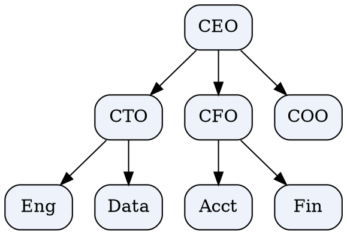
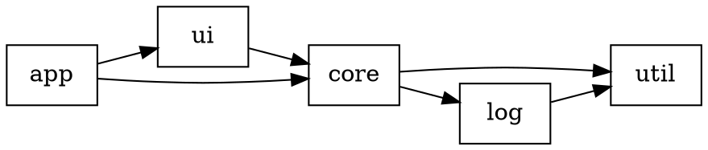
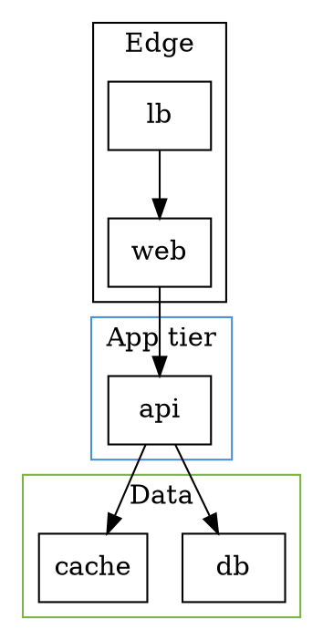
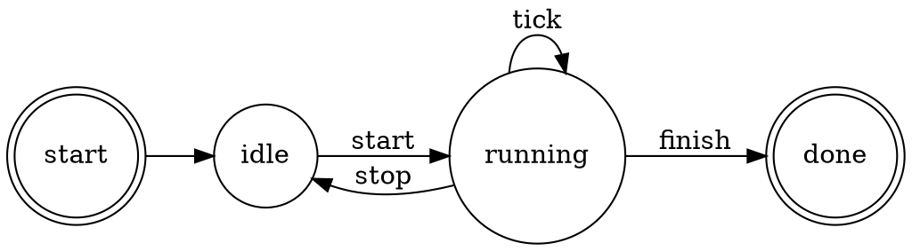
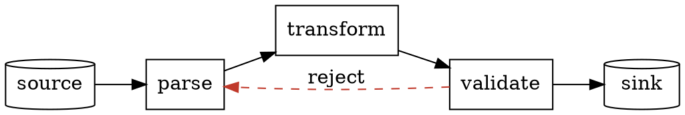
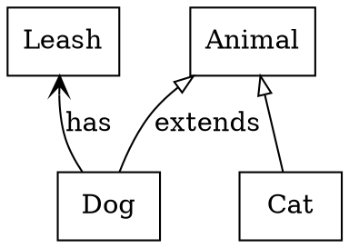

# gviz-patterns

Recipes for getting good diagrams out of `%graph-viz`. Pairs with
[[gviz-dot-syntax]] (the language) and [[gviz-gall-api]] (the
protocol). Assumes working Hoon and basic graph theory.

## Rendering from Hoon

The whole pipeline is a plain gate, `run:lib` in `lib/gviz.hoon` — no
agent required:

```hoon
=/  cmd=command:gviz
  [%render 0v0 [%dot %svg ~ ~ %.n %.n %.n %.n] 'digraph {a -> b}']
=/  res  (run:gviz cmd)
?:  ?=(%error -.res)
  ~|(err+err.res !!)
?>  ?=(%svg -.res)
svg.res
```

The bunt render-opts `[%dot %svg ~ ~ %.n %.n %.n %.n]` = engine `%dot`,
format `%svg`, no defaults, default scale, no flip, not quiet, not
verbose, no graph noun. From a live agent, wrap this in the
subscribe-then-poke protocol ([[gviz-gall-api]]); from the dojo use
`+dot-svg`.

### With options

```hoon
::  verbose + return the geometry noun + shrink to fit 8x6 inches
=/  opts=render-opts:gviz
  :*  %dot  %svg
      ~[[%graph 'size' '8,6'] [%node 'shape' 'box']]  :: -G/-N defaults
      ~                                                :: scale
      %.n  %.n                                         :: flip-y, quiet
      %.y  %.y                                         :: verbose, want-graph
  ==
(run:gviz [%render 0v0 opts src])
```

## Building graphs programmatically

Two levels. **Almost always: build DOT text**, then hand it to the
parse→…→svg pipeline. Direct AST/resolved construction is for tooling
that bypasses the parser and is rarely worth it.

### Turn structured data into DOT

The pipeline stages are `parse → resolve → rank → order → coord →
route → svg`, exposed as the `lib/` imports `parse attr rank order
coord route svg`. You feed the first stage text, so your job is a
data→text printer.

**A list → a chain:**
```hoon
|=  items=(list @t)
^-  @t
%-  crip
;:  weld
  "digraph {rankdir=LR "
  `tape`(zing (turn items |=(n=@t "\"{(trip n)}\" -> ")))
  "_end}"
==
```
(For production, terminate the chain cleanly rather than a sentinel;
this shows the shape.)

**A `(map @t (set @t))` adjacency → edges:**
```hoon
|=  adj=(jar @t @t)                      :: node -> neighbors
^-  @t
=/  lines
  %-  ~(rep by adj)
  |=  [[k=@t vs=(list @t)] acc=(list tape)]
  %+  weld  acc
  %+  turn  vs
  |=(v=@t "\"{(trip k)}\" -> \"{(trip v)}\"")
(crip "digraph {{(zing (join "\0a" lines))}}")
```

**A tree → a hierarchy:** walk depth-first, emitting
`parent -> child` for each edge; `rankdir=TB` gives the classic
top-down tree.

Escape/quote every id you interpolate (wrap in `"…"`) so labels with
spaces or punctuation survive — see [[gviz-dot-syntax]] on quoting.

## Diagram templates

Each is DOT text you pass to `%render`. Rendered SVG structure follows
`-Tsvg` (`<g class="node">`/`<g class="edge">` with `<title>`).

### Organization chart


### Dependency graph

Layers read left→right; a back-pointing edge signals a cycle (see
pitfalls).

### System architecture (clusters)


### Workflow / state machine


### Data flow


### UML-style (class boxes)

v1 has no `record`/HTML shapes, so compartmentalized UML tables are out
— use a plain box with a multi-line `label` (`\l`-terminated lines) as
a substitute.

## Styling guidelines

- **Shape conventions**: box = process/module, ellipse = start/end,
  cylinder = datastore, diamond = decision, doublecircle = terminal
  state, point = junction.
- **Direction**: `rankdir=LR` for pipelines and timelines; `TB` for
  hierarchies and org charts.
- **Fills** need `style=filled`; set `fillcolor` and keep `color`
  (border) darker for contrast.
- **Emphasis** with `penwidth` and `color`, not just hue — survives
  greyscale printing.
- **Line semantics**: `style=dashed` for optional/async, `dotted` for
  weak/implicit, solid for primary; be consistent across the diagram.
- Remember colors are **X11-valued**: `green`=`#00ff00`,
  `gray`=`#bebebe`, `purple`=`#a020f0`. Prefer explicit `#hex` when
  exact brand color matters ([[gviz-dot-syntax]] colors).

## Accessibility

- **Do not encode meaning in color alone** — add text labels or line
  styles (dashed/dotted) so the diagram survives color blindness and
  greyscale.
- Color-blind-safe categorical hues (Okabe–Ito): `#0072b2` (blue),
  `#e69f00` (orange), `#009e73` (green), `#cc79a7` (pink), `#56b4e9`
  (sky), `#d55e00` (vermillion), `#f0e442` (yellow), `#000000`.
- Every node/edge already emits a `<title>` in the SVG — keep node
  **names** meaningful (not `n1`,`n2`) so that title text is useful to
  screen readers and tooltips.
- Keep `fontsize` ≥ 12 and ensure label-vs-fill contrast.

## Performance

- The `dot` engine is `O(V·E)`-ish with a mincross inner loop; it is
  comfortable into the low thousands of nodes but is **not** a
  large-graph engine (no `sfdp` in v1). For > ~2–3k nodes, pre-filter
  or collapse subgraphs before rendering.
- **Cost drivers**: long edges spanning many ranks create *virtual
  nodes* (each rank crossed = one), and dense within-rank
  connectivity drives *crossings* — both show up in `verbose` `diag`.
- **`minlen`/`weight`** shape ranks cheaply; deep cluster nesting is
  more expensive (v1 does innermost-cluster contiguity only).
- Layout runs under `+mule`; a pathological graph returns
  `[%error %layout …]` rather than hanging the agent — but avoid
  feeding it adversarial input.

## Common pitfalls

- **Circular dependencies**: `dot` breaks cycles by temporarily
  reversing edges (arrows stay correct). A back-pointing arrow in the
  output is your cue that the data has a cycle — often a bug worth
  surfacing, not just a layout artifact.
- **Deeply nested subgraphs**: v1 keeps only the *innermost* cluster's
  members contiguous; deep nesting won't lay out as cleanly as
  upstream graphviz. Flatten where you can.
- **Label overflow**: long single-line labels widen ranks. Break with
  `\n`/`\l`/`\r`, or set `fixedsize=true` + explicit `width`/`height`
  and accept clipping.
- **Undirected edge in a digraph** (`a -- b`) is a **parse error**,
  not a coercion — match the operator to the graph type.
- **`record`/HTML labels** are rejected — use plain shapes with
  multi-line labels.
- **Unknown attribute** names don't error; they're preserved and each
  emits one `unknown attribute: name` **warning**. Read `warnings` (or
  set `quiet` to drop them) to catch typos like `fillColor`.

## Integration patterns

- **Render on poke, store in clay**: on receiving the `%svg` result,
  write `svg.res` to a `mar/svg` file in a desk directory; serve it via
  Eyre or `%docket`. The SVG is a complete standalone document.
- **Cache by source hash**: the pipeline is a pure function of
  `(opts, src)`. Key a `(map @uv @t)` on `` `@uv`(shax (jam [opts src])) ``
  → SVG; skip re-rendering identical requests. Safe because the agent
  is stateless.
- **Store the geometry, not the SVG**: set `want-graph=%.y` and persist
  the `$graph` noun ([[gviz-gall-api]]) when you want to re-style or
  render to a different target later without re-running layout.
- **Fan-out from another agent**: pick a fresh `uid` per request
  (`eny.bowl`), subscribe on `/result/[uid]`, poke, and match the
  result back to the request by `uid` in the wire.

## Debugging

1. **Turn on `verbose`** (`verbose=%.y`) and read `diag`
   `[nodes edges clusters nrank virtuals crossings]`:
   - `nodes`/`edges` far off from what you expect → subgraph
     cross-product expansion or `strict` merging changed the graph.
   - high `virtuals` → long edges spanning many ranks; add `minlen`
     shortcuts or restructure.
   - high `crossings` → dense connectivity; consider `rank=same`
     groups or splitting into clusters.
2. **Read `warnings`** (don't set `quiet` while debugging) — unknown
   attributes and bad `rank` values report here.
3. **Bisect the DOT**: parse errors give 1-indexed `line`/`col`; render
   a minimal subgraph and add statements back until it breaks.
4. **Inspect geometry**: `want-graph=%.y`, then examine `nodes`
   centers/`half` and `edges` splines directly — cheaper than eyeballing
   SVG when positions look wrong. Coordinates are y-up points
   ([[gviz-gall-api]] noun conventions).
5. **Test in isolation**: `-build-file /=graph-viz=/lib/gviz/hoon` and
   call `run:gviz` in the dojo, or use `+dot-svg 'DOT text'`.
